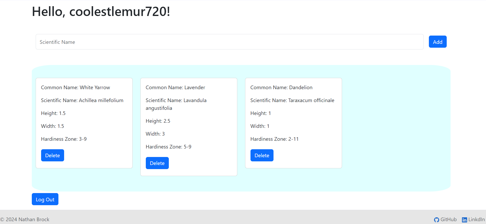

# garden_app
a portfolio app meant to help me with full stack development as well as a resource to help make gardening more organized for me.

Skills included in this project:
HTML5, CSS3, and Bootstrap
Javascript
PostgreSQL
Express
React
Node
Authentication & Authorization with JWT

Things that still need to be improved:
- add functionality to login in with other parties (Google, X, etc)

Current Plant Inventory:
Common name         Scientific name
"{""White Yarrow""}"	"Achillea millefolium"
"{Dill}"	"Anethum graveolens"
"{Borage}"	"Borago officinalis"
"{Caraway}"	"Carum carvi"
"{Celosia}"	"Celosia argentea"
"{Cilantro}"	"Coriandrum sativum"
"{""Butternut Squash""}"	"Cucurbita moschata"
"{Echinacea}"	"Echinacea purpureae"
"{Fennel}"	"Foeniculum vulgare"
"{Hyssop}"	"Hyssopus officinalis"
"{Lavender}"	"Lavandula angustifolia"
"{Lovage}"	"Levisticum officinalis"
"{Chamomile}"	"Matricaria chamomilla"
"{""Lemon Balm""}"	"Melissa officinalis"
"{Peppermint}"	"Mentha x piperita"
"{""Lemon Mint"",""Bee Balm""}"	"Monarda citriodora"
"{Bergamot}"	"Monarda didyma"
"{Catnip}"	"Nepeta cataria"
"{""Thai Basil"",""Licorice Basil"",""Italian Basil"",""Genovese Basil"",""Purple Basil"",""Holy Basil""}"	"Ocimum basilicum"
"{Marjoram}"	"Origanum majorana"
"{Oregano}"	"Origanum vulgare"
"{Anise}"	"Pimpinella anisum"
"{""Mountain Mint""}"	"Pycnanthemum verticillatum"
"{Rosemary}"	"Rosmarinus officinalis"
"{Sage}"	"Salvia officinalis"
"{""Summer Savory""}"	"Satureja hortensis"
"{Marigold}"	"Tagetes ..."
"{Dandelion}"	"Taraxacum officinale"
"{Thyme}"	"Thymus vulgaris"
